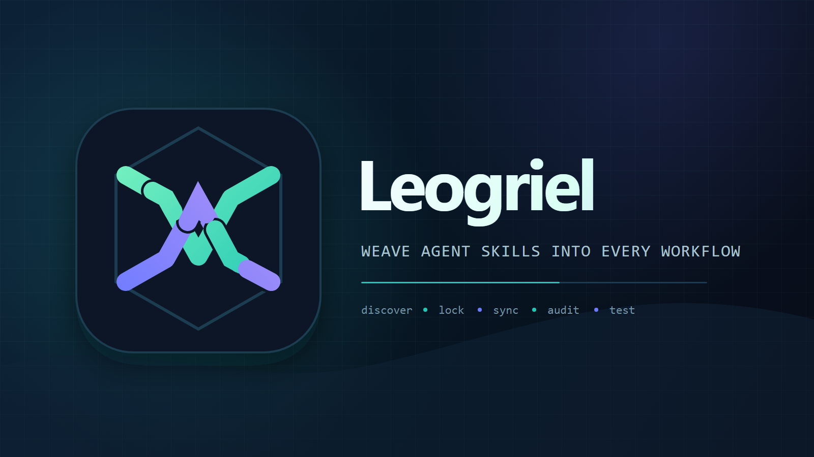

# Leogriel

<p align="center">
  
</p>

Universal, package-manager-style CLI for managing **Agent Skills** across AI coding agents.

**Leogriel** installs project skills into `.leogriel/skills/` and personal skills into `~/.leogriel/skills/`, then syncs them (symlink, junction on Windows, or copy) into Claude Code, Cursor, OpenCode, Codex, Gemini CLI, Grok, Pi, and other [agentskills.io](https://agentskills.io)-compatible agents.

> **Status**: v1.0.0-beta.2 — the first Leogriel-branded prerelease, with experimental paired behavioral testing on top of the 0.8 parser, audit, backup, plugin-inspection, artifact, and redaction foundations. See [CHANGELOG.md](./CHANGELOG.md).

Machine-readable commands emit one stable JSON envelope with `schemaVersion: 1`; warnings and errors stay on stderr. Official releases smoke-test both packed tarballs and the package fetched back from npm before the tag is created.

**Documentation** (commands, configuration, migration, troubleshooting): **[xfurti.github.io/leogriel](https://xfurti.github.io/leogriel/)** · IT/EN

## Installation

```bash
npm install -g @leogriel/cli@next
# or
pnpm add -g @leogriel/cli@next
# or without global install
npx @leogriel/cli@next --help
```

The public package is `@leogriel/cli`; installing it provides the `leogriel` command. Use the `next` dist-tag during the beta series; untagged installs are reserved for the stable channel.

## Migrating from skillctl

Leogriel is the new name of the project previously published as `skillctl`. npm packages cannot be renamed in place, so the Leogriel packages use the new `@leogriel/*` scope:

```bash
npm uninstall -g @skillctl/cli
npm install -g @leogriel/cli@next
leogriel --version
```

The portable project files remain named `agent-skills.json` and `agent-skills.lock`. Leogriel writes new project state under `.leogriel/` and new user state under `~/.leogriel/`, while recognizing legacy `.skillctl/` stores, managed-copy markers, transaction journals, plugin metadata, configuration, and `SKILLCTL_*` environment overrides during migration. New `LEOGRIEL_*` variables take precedence when both forms are present.

Existing `@skillctl/*` releases remain separate historical npm packages. Do not publish new code under both scopes.

## Quick Start

```bash
leogriel init
leogriel import          # copy existing agent skills into .leogriel/skills
leogriel add github:vercel-labs/agent-skills@main#web-design-guidelines
leogriel add npm:some-skill-pkg@^2
leogriel add file:./my-skill
leogriel install          # fetch + sync all agents
leogriel sync             # re-link only
leogriel list
leogriel doctor
```

Discover a skill before installing it, or inspect a source without changing project state:

```bash
leogriel search typescript --provider skills.sh
leogriel search typescript --owner vercel-labs --add vercel-labs/skills/find-skills --yes
leogriel info skills.sh/vercel-labs/skills/find-skills
```

Project files (commit these):
- `agent-skills.json` — declarative manifest (like `package.json`)
- `agent-skills.lock` — reproducible YAML lockfile (like `pnpm-lock.yaml`)

Project store: `.leogriel/skills/<name>/SKILL.md` (+ optional `scripts/`, `references/`). Commit vendored project skills so private or unpublished skills are available to the whole team.

Global skills are explicit and remain outside the project:

```bash
leogriel add -g file:./my-personal-skill
leogriel list -g
leogriel doctor -g
leogriel remove -g my-personal-skill
```

Local commands search parent directories for `agent-skills.json`. Outside an initialized project, use `-g` or run `leogriel init` first.

## Reproducible installs

Remote requests remain readable in the manifest, while the lock pins GitHub and skills.sh sources to a full commit SHA and npm sources to an exact version plus tarball integrity. On a new machine, or after deleting the store, this restores the exact locked content without changing the lockfile:

```bash
leogriel install --frozen
```

`outdated` reports current, outdated, modified, legacy, unavailable, and unsupported entries independently. `update --dry-run` emits the same plan without writing. `update --latest --save --yes` may cross an npm constraint and records the chosen version exactly; GitHub and skills.sh retain their declared ref.

```bash
leogriel outdated
leogriel update --dry-run
leogriel update my-skill
leogriel update npm-skill --latest --save --yes
```

Imported and local skills use project-relative `file:./.leogriel/skills/<name>` entries, so committed skills remain available without a registry.

### Migrating legacy local skills

Project locks created before 0.6 may still reference `~/.leogriel/skills/<name>` or `local:imported/<name>`. Re-add source directories with `leogriel add file:./path/to/skill`, or run `leogriel import` for skills discovered in agent directories. Verify the generated `.leogriel/skills/` content, then commit it together with the refreshed manifest and lock. Global/personal skills remain explicit through `-g`.

## Selective sync and automation

Without scope flags, `sync` keeps the compatible default and targets both project and global directories. Pruning is opt-in and removes only targets that leogriel can prove it manages.

```bash
leogriel sync --project --agent codex
leogriel sync --global --agent codex,claude-code
leogriel sync --project --prune --dry-run
leogriel sync --project --agent codex --skill my-skill --replace-unmanaged --yes
leogriel doctor --json
```

Explicit unmanaged replacement first moves the original target to `.leogriel/backups/sync/` (or the global equivalent) and restores it automatically if replacement fails.

Backups have logical IDs independent from their Windows-safe directory names and can be inspected, dry-run restored, restored with rollback, or removed explicitly:

```bash
leogriel backup list --json
leogriel backup info <id>
leogriel backup restore <id> --dry-run
leogriel backup restore <id> --yes
leogriel backup remove <id> --yes
```

Every first-party command supports `--json` and writes one envelope with `schemaVersion`, `ok`, `command`, `data`, `warnings`, and `errors`. Exit codes are 0 for success, 1 for operational warnings/partial results, and 2 for fatal or validation failures.

## Supported Agents

| Agent | Project path | Global path |
|-------|--------------|-------------|
| Claude Code | `.claude/skills` | `~/.claude/skills` |
| Cursor | `.agents/skills` | `~/.cursor/skills` |
| OpenCode | `.opencode/skills` | `~/.config/opencode/skills` |
| Codex | `.codex/skills` | `~/.codex/skills` |
| Gemini CLI | `.gemini/skills` | `~/.gemini/skills` |
| Grok | `.grok/skills` | `~/.grok/skills` |
| Pi | `.pi/skills` | `~/.pi/agent/skills` |

More agents via plugins (experimental) or future adapter releases.

## Leogriel as a skill

The repo ships a first-party Agent Skill at `skills/leogriel/` so coding agents know how to use the CLI (manifest, lock, import, audit). The leogriel repo dogfoods it via root `agent-skills.json`.

```bash
# New project — add meta-skill from GitHub
leogriel init --with-skill

# Or explicitly
leogriel add github:xFurti/leogriel#skills/leogriel
leogriel install

# In-repo (e.g. leogriel monorepo)
leogriel add file:./skills/leogriel
leogriel install && leogriel sync

# Lint a skill directory
leogriel skill validate skills/leogriel
```

## Common Tasks

```bash
# Import every skill already in agent directories without changing the sources
leogriel import --dry-run
leogriel import

# Optional selection and conflict resolution
leogriel import --select
leogriel import --interactive

# Migrate from npx skills
leogriel import from-npx --dry-run
leogriel import from-npx --sync --write-manifest

# Security scan (CI-friendly)
leogriel audit --json --strict
leogriel audit --format sarif --output results.sarif

# Re-fetch and re-sync
leogriel update

# Print shell completion; redirect it using your shell's normal profile setup
leogriel completion powershell
```

Completion scripts are printed to stdout and never modify profiles. Typical setup:

```bash
# Bash
leogriel completion bash > ~/.local/share/bash-completion/completions/leogriel

# Zsh (ensure ~/.zfunc is in fpath)
leogriel completion zsh > ~/.zfunc/_leogriel
```

```powershell
# Current PowerShell session; add the same expression to $PROFILE if desired
leogriel completion powershell | Out-String | Invoke-Expression
```

## Experimental plugins

Plugins can register commands, adapters, registry sources, catalog providers, and audit rules. npm plugins are integrity-locked under `~/.leogriel/plugins/`; local plugins require `--allow-local`. Plugins execute Node.js code with your user permissions and are not sandboxed.

```bash
leogriel plugin add npm:@example/leogriel-plugin@^1
leogriel plugin add npm:@example/leogriel-plugin@^1 --dry-run
leogriel plugin list
leogriel plugin doctor
leogriel plugin disable @example/leogriel-plugin
```

The dry-run resolves and verifies the package without installing it, then reports publisher, tarball integrity, entrypoint, API version, declared capabilities, dependencies, npm scripts, and trust status. Capabilities are declarations rather than permissions; plugins are not sandboxed.

## Parser, audit, and artifacts

`info`, validation, import, and audit share one strict UTF-8/YAML parser. Directory integrity is still computed with the canonical lockfile algorithm, so existing `0.6.x` and `0.7.x` hashes remain compatible. Audit stays offline by default and categorizes findings across integrity, provenance, filesystem, execution, network, secrets, prompt injection, policy, plugins, and managed targets. Heuristic findings include confidence and non-secret evidence.

Persistent artifacts are opt-in and use the versioned `.leogriel/artifacts/{audit,test,reports}/` contract. This directory is ignored by Git. Structured output passes through field-aware secret redaction; hashes, integrity values, versions, and ordinary identifiers are preserved.

## Experimental behavioral testing

Versioned YAML tests compare the same task without and with a skill using separate workspaces and separate HOME, USERPROFILE, XDG, and CODEX_HOME directories. The initial 0.9 runner supports Codex only and validates its version, flags, strict configuration, network control, and environment filtering before execution.

```bash
leogriel test init my-skill
leogriel test validate
leogriel test list --json
leogriel test my-skill --runs 3 --model <model> --json
leogriel test my-skill --output my-skill-result.json
```

Tests are sequential. Network and web search are denied by default and must be enabled independently in YAML. Command assertions execute arbitrary programs: interactive runs show executable, argv, and cwd once; non-interactive runs require `--trust-tests`. The flag does not change the runner policy or create an OS sandbox. `--keep-workspace` is explicit and warns that agent output may be sensitive. Isolated HOME/XDG/CODEX_HOME trees and credentials are never copied to retained workspaces.

This reduces configuration leakage but is not an absolute security sandbox. Authentication accepts `CODEX_API_KEY` or `OPENAI_API_KEY`; conflicting values fail before execution, and the selected key is exposed only to the Codex process. Opt-in live runs can instead use `LEOGRIEL_CODEX_AUTH_MODE=chatgpt` with an explicit, dedicated `LEOGRIEL_CODEX_AUTH_HOME` already authenticated by `codex login`; leogriel checks `codex login status`, never falls back to `~/.codex`, and does not copy, log, modify, redact, or delete that profile. Agent subprocesses receive an explicit safe allowlist derived from the isolated environment—enough to find executables and use isolated HOME and temporary directories—while API keys and every non-allowlisted variable remain excluded. If no model is pinned, paired results are useful within that execution but are not declared stable across dates or environments.

Case verdicts use whole-case pass/fail outcomes and paired runs, not assertion counts. The aggregate verdict is `improved`, `regressed`, `unchanged`, or `inconclusive`; mixed outcomes, errors, timeouts, and fewer than three samples are inconclusive. See [behavioral testing](./docs/behavioral-testing.md) and the [1.0 roadmap](./ROADMAP.md).

See the [docs site](https://xfurti.github.io/leogriel/) for the full command reference, config schema, Windows notes, and coexistence with other tools.

## Development

**Requirements:** Node.js >= 22.13, pnpm 11.x

```bash
git clone https://github.com/xFurti/leogriel.git
cd leogriel
pnpm install
pnpm build
pnpm test
```

Run the CLI locally: `node packages/cli/bin/leogriel.js --help`

Architecture and design: [leogriel-design.md](./leogriel-design.md) · Contributing: [CONTRIBUTING.md](./CONTRIBUTING.md)

### Maintainer release setup

Each of the twelve `@leogriel/*` npm packages, including the explicitly unstable `@leogriel/testing`, must configure the repository `xFurti/leogriel`, workflow `release.yml`, environment `npm-production`, and `npm publish` as its Trusted Publisher. The workflow needs no `NPM_TOKEN`: it verifies or publishes every tarball by SRI, preserves provenance, smoke-tests packed and registry content, waits until all packages are visible, and only then creates the annotated tag and GitHub Release.

## Authors

- [xFurti](https://github.com/xFurti)
- [Gabry848](https://github.com/gabry848)

## License

[MIT](./LICENSE) — Copyright (c) 2026 xFurti, Gabry848
