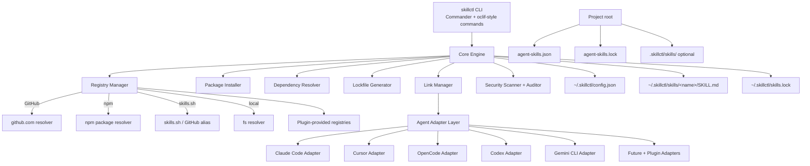
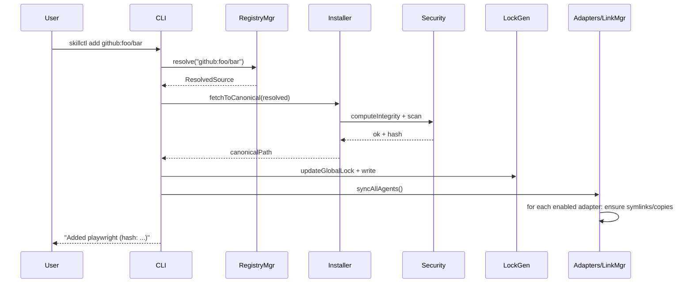

# skillctl: Universal Agent Skills Manager

**Author:** [Senior Software Architect, OSS Maintainer placeholder]  
**Date:** 2026-07-04  
**Status:** Draft  
**Version:** 0.1 (Design)

---

## Overview

`skillctl` is a universal, package-manager-style CLI for managing **Agent Skills** across the fragmented ecosystem of AI coding agents (Claude Code, Cursor, Codex, OpenCode, Gemini CLI, Antigravity, Pi Agent, and future compatible tools).

The core problem is duplication and configuration drift: each agent uses different directories (e.g., `~/.claude/skills/`, `~/.cursor/skills/`, `~/.config/opencode/skills/`, `~/.agents/skills/`, project-local variants), installation methods, and update semantics. Users today must manually copy or rely on per-tool CLIs like `npx skills`.

**Note on prior art (naming and layout)**: An existing Python CLI also named "skillctl" (https://skillctl.xyz/, PyPI `skillctl`, GitHub dvlshah/skillctl and r3b1s/skillctl variants) provides search/install/lint with `~/.skillctl/repos/` clones and symlinks into agent directories (e.g. `~/.claude/skills/`) plus a manifest. `npx skills` (vercel-labs/skills) uses a de-facto universal `.agents/skills` layout + sophisticated symlink/copy logic (see agents.ts + installer.ts). This design acknowledges the collision risk for the provisional name "skillctl" and `~/.skillctl/` canonical store specified in the original vision. See "Coexistence & Migration Strategy" and Alternatives Considered for analysis and recommended mitigations (scoped package, explicit interop, or future rename decision).

**Proposed solution**: A single canonical skill store at `~/.skillctl/skills/` (plus project-scoped equivalents). `skillctl` automatically materializes the correct views for every detected agent using symlinks (preferred), junctions (Windows), copies, or adapter-specific configuration. It treats skills as versioned, reproducible dependencies with manifests, lockfiles, checksums, and provenance — exactly like `npm`/`pnpm`/`cargo`/`brew` but specialized for the Agent Skills open standard (`SKILL.md` + optional `scripts/`, `references/`, `assets/`).

`skillctl` **does not** replace sources such as skills.sh, `npx skills`, GitHub, or npm packages. It consumes them as registries and provides the missing universal management, sync, and project portability layer. It aims to be interoperable with (and potentially complementary or a superset in the package-manager dimension to) existing managers.

---

## Background & Motivation

The Agent Skills ecosystem (defined at https://agentskills.io/specification) has exploded in 2025-2026:

- Skills are directories containing at minimum `SKILL.md` (YAML frontmatter + Markdown instructions).
- Dozens of agents support them: Claude Code (`~/.claude/skills/` + `.claude/skills/`), Cursor, OpenCode (`~/.config/opencode/skills/` + `.opencode/skills/`), Gemini CLI, Codex, Antigravity, Continue, and ~70 more (see vercel-labs/skills supported list).
- Primary distribution today is `npx skills add owner/repo` (vercel-labs/skills / antfu/skills-cli). It implements a sophisticated multi-agent system: `agents.ts` defines 60+ `AgentConfig` with exact `skillsDir`/`globalSkillsDir` (matching the examples here: `~/.claude/skills`, `~/.cursor/skills`, `~/.config/opencode/skills`, `.agents/skills` etc.) plus `detectInstalled`; `installer.ts` (~1300 LOC) handles canonical materialization, `InstallMode` (symlink/copy), Windows junctions, `realpath` safety, ELOOP/parent symlink handling, name sanitization; it uses `skill-lock.ts` (versioned JSON with `source`, `ref`, `skillFolderHash` integrity, timestamps), `sync.ts`, GitHub/git/local resolution, project/global scopes, and experimental lock-based install. It already delivers a strong "install once, visible everywhere" experience for many users.
- Complementary (and overlapping) tools exist: `gh skill`, `agent-skills-cli`, `skillbook`, `openskills`, `npm-agentskills`, **and notably the Python `skillctl` (skillctl.xyz / dvlshah/skillctl / r3b1s/skillctl)** which uses `~/.skillctl/repos/`, clone+symlink+manifest flows, linting, and similar commands. See Issue 1 / Coexistence section for full positioning.
- Pain points repeatedly reported:
  - No single source of truth → skills diverge across agents and machines.
  - Project onboarding friction: `git clone` does not yield working skills.
  - No reproducible installs, no lockfiles with integrity, no audit/provenance story.
  - Per-agent CLIs duplicate effort; adding a new agent requires changes everywhere.
  - Windows symlink support is fragile.
  - No first-class plugin or registry extensibility for the management layer.

Existing tools (especially vercel-labs/skills) already solve sophisticated installation + multi-agent linking. `skillctl` differentiates by providing strict package.json-style declarative manifests (`agent-skills.json`), reproducible pnpm-style YAML locks across mixed sources (GitHub + npm + local), first-class plugin extensibility for the long tail of agents/registries, dedicated provenance/audit/doctor tooling, and a monorepo architecture optimized for OSS contribution of adapters. It is positioned as a complementary management layer that can detect and interoperate with existing installs rather than a complete replacement. See "Interop with Existing Tools" and Alternatives.

---

## Goals & Non-Goals

### Goals

- **Canonical store**: One primary location (`~/.skillctl/skills/`) for all user-owned skills; project skills resolved via manifests/locks.
- Global + project scope support with clear precedence.
- Automatic configuration of *all detected agents* via dedicated, independent adapters.
- Zero duplication: skills live once; agents see symlinks or equivalent.
- Reproducible installs via `agent-skills.json` + `agent-skills.lock`.
- First-class sources: `skills.sh`, GitHub, npm packages, local paths, future registries.
- Full OSS: MIT/Apache-2, cross-platform (Win/Linux/macOS), extensible via plugins.
- Security primitives: checksums, provenance, audit, trust model.
- Commands matching the requested UX (`init`, `add`, `install`, `sync`, `doctor`, `audit`, etc.).

### Non-Goals

- Building or hosting a new primary marketplace (use existing: skills.sh, GitHub, npm).
- Replacing `npx skills` or `gh skill` (interoperate; `skillctl` can consume their outputs/locks or call them as a backend; see Interop below).
- Implementing agent runtime execution of skills.
- Supporting non-`SKILL.md` formats or breaking the agentskills.io spec.
- Bundling a large number of first-party skills (focus on the manager).
- GUI or IDE plugins in v1 (CLI first).

### Interop with Existing Tools (npx skills, Python skillctl, etc.)

`skillctl` MUST detect existing installations:
- Scan for `.agents/skills`, `~/.skillctl/repos`, `skills-lock.json` (vercel format), and Python skillctl manifests.
- `skillctl import --from-npx` (or `--from-skillctl`) to migrate skills into the canonical store while preserving provenance.
- Avoid double-managing directories: respect `.skillctl/config.json` "managedBy" or lock presence; warn on overlap and offer "adopt" mode.
- For npx skills' advanced installer logic, the design intentionally re-uses similar patterns (junctions, safety checks) but layers declarative manifests + YAML locks on top.
- Future: optional adapter that delegates symlink management to npx skills when present.

This reduces fragmentation risk. A "contribute upstream" path (porting manifest/lock/audit features to vercel-labs/skills) remains viable long-term (see Alternatives).

---

## Proposed Design

### High-Level Architecture



### Core Components (Modular Packages)

Recommended monorepo layout (pnpm workspaces):

```
skillctl/
├── packages/
│   ├── cli/                  # @skillctl/cli - entrypoint, command registration
│   ├── core/                 # @skillctl/core - shared types, config, fs utils, resolver
│   ├── registry/             # @skillctl/registry - RegistryManager + built-in sources
│   ├── installer/            # @skillctl/installer - fetch, validate, materialize to canonical
│   ├── adapters/             # @skillctl/adapters - base + concrete agent adapters
│   │   ├── base/
│   │   ├── claude/
│   │   ├── cursor/
│   │   └── ...
│   ├── link-manager/         # @skillctl/link - symlink/copy logic + cross-platform
│   ├── lockfile/             # @skillctl/lockfile - parser, generator, diff
│   ├── manifest/             # @skillctl/manifest - agent-skills.json schema + validator
│   ├── security/             # @skillctl/security - checksum, provenance, audit scanner
│   ├── plugin-system/        # @skillctl/plugins - loader, registration API
│   └── types/                # shared interfaces
├── bin/
│   └── skillctl
├── tests/
├── docs/
└── pnpm-workspace.yaml
```

### Stack Choice

- **Language/Runtime**: TypeScript 5.6+ targeting Node.js >= 22.13 (LTS). ESM only.
  - Rationale: Excellent ecosystem integration with npm sources, easy plugin loading via `import()`, mature fs/path handling. Matches skills.sh CLI heritage.
- **CLI Framework**: Commander.js + supporting libs (ora, chalk, inquirer, table). oclif-style plugin discovery hooks via dynamic registration (we implement a lightweight plugin host rather than full oclif to keep footprint small; future migration path documented).
- **Package Manager**: pnpm (for workspaces + strict symlinks during development).
- **Distribution**: Primary package `@skillctl/cli` (scoped) published to npm. Includes bin shim so `npx skillctl`, `npm i -g @skillctl/cli`, and `skillctl` commands work. Unscoped `skillctl` left unclaimed. See Key Decision #1. Single binary fallback via `pkg` or Bun compile for v1+.
- **Git interaction**: `execa` + `isomorphic-git` (fallback) or native git (preferred for auth).
- **Lockfile**: YAML (js-yaml or yaml) styled after pnpm-lock.yaml for human readability.
- **Testing**: Vitest + node:test for integration.
- **Cross-platform**: `fs.symlink` + explicit Windows junction support (`fs-extra` or `junctions`); graceful fallback to copy with warnings. Detect Developer Mode on Win.

**Expected scale (v1 targets)**:
- 500–2000 skills per user (typical).
- Skill size: 5–200 KiB (SKILL.md dominant; scripts rarely large).
- `sync` latency target: < 150 ms for 200 skills on SSD.
- Lockfile size: ~50–300 KiB for complex projects.

**Performance & Scale Considerations** (addressing Issue 8):
- Parallelism: limited to 8 concurrent fetches (configurable `SKILLCTL_PARALLEL`); GitHub token recommended to avoid rate limits.
- Fetch strategy: prefer shallow zip/tarball over full clone for Git sources; content-addressable cache under `~/.skillctl/cache/` keyed by integrity (skip re-fetch if present).
- Hashing: fast-path `stat` + mtime + size + stored integrity before full recursive SHA256. Only re-hash on `add --force` or detected drift.
- Symlink overhead: noted for Windows junctions; batch operations and skip if `realpath(target) === canonical`.
- Large sync: streaming + progress; memory: stream manifests, do not load all SKILL.md bodies.
- Validated against similar patterns in npx skills (they handle hundreds efficiently). Targets will be load-tested in PR12. Bottleneck likely network or Windows FS; mitigations above.

### Internal APIs (Key Interfaces)

```ts
// packages/core/src/types.ts
export interface SkillRef {
  name: string;           // canonical lowercase-hyphen name
  version?: string;       // semver or git ref
  source: string;         // original specifier: "github:...", "npm:...", "local:...", "skills.sh/..."
}

export interface ResolvedSkill {
  name: string;
  canonicalPath: string;  // ~/.skillctl/skills/<name>
  integrity: string;      // sha256:<hex> of canonical contents
  resolvedSource: string;
  fetchedAt: string;
  // provenance fields
}

export interface AgentAdapter {
  readonly id: string;           // 'claude-code'
  readonly name: string;
  readonly projectPaths: string[]; // relative to cwd, e.g. ['.claude/skills']
  readonly globalPaths: string[];  // e.g. [os.homedir() + '/.claude/skills']
  detect(): Promise<boolean>;      // is this agent relevant on this machine?
  ensureTarget(skillName: string, targetPath: string, canonical: string, mode: 'symlink' | 'copy'): Promise<void>;
  removeTarget(skillName: string, targetPath: string): Promise<void>;
  // adapter may also write agent-specific config
}

export interface RegistrySource {
  readonly id: string;
  match(spec: string): boolean;
  resolve(spec: string, options?: {ref?: string}): Promise<ResolvedSource>;
  fetch(resolved: ResolvedSource, dest: string): Promise<{integrity: string}>;
}

export interface SkillManifest {
  name?: string;
  version?: string;
  agentSkills?: {
    dependencies?: Record<string, string>; // name -> specifier
    devDependencies?: Record<string, string>;
  };
  // future: engines, peerSkills, etc.
}
```

### Data Model & Storage

**Global (user)**:
```
~/.skillctl/
├── config.json
│   {
│     "version": 1,
│     "store": "~/.skillctl/skills",
│     "defaultMode": "symlink",
│     "agents": { "claude-code": true, "cursor": true, ... },
│     "registries": [...],
│     "trustedSources": ["github:vercel-labs/*"]
│   }
├── registry.json          # cached discovery metadata (optional)
├── skills.lock            # global installed skills (lock entries)
└── skills/
    ├── browser-testing/
    │   ├── SKILL.md
    │   ├── scripts/
    │   └── references/
    └── react-review/
        └── SKILL.md
```

**Project** (committed):
```
my-repo/
├── agent-skills.json      # like package.json for skills
├── agent-skills.lock      # like pnpm-lock.yaml
├── .skillctl/             # optional local overrides (gitignored)
│   └── skills/            # vendored or symlinked local skills
└── src/
```

**agent-skills.json example** (fuller schema; see Appendix for complete Zod/JSON Schema):
```json
{
  "name": "my-frontend-project",
  "version": "1.2.0",
  "agentSkills": {
    "dependencies": {
      "web-design-guidelines": "vercel-labs/agent-skills#web-design-guidelines",
      "playwright": "skills.sh/playwright@^1.0",
      "local-review": "file:./skills/my-review"
    },
    "devDependencies": {}
  }
}
```
**Validation rules (MVP)**: name matches dir (per agentskills.io), specifier formats defined in Registry, no circular deps in v1, project vs global same-name: project wins in project context, warning on global override.

**agent-skills.lock (excerpt, YAML style)**:
```yaml
lockfileVersion: '1.0'
agents:
  - claude-code
  - cursor
skills:
  web-design-guidelines:
    specifier: vercel-labs/agent-skills#web-design-guidelines
    resolved: github:vercel-labs/agent-skills@abc123def/skills/web-design-guidelines
    integrity: sha256:9f86d081884c7d659a2feaa0c55ad015a3bf4f1b2b0b822cd15d6c15b0f00a08
    name: web-design-guidelines
    canonicalPath: ~/.skillctl/skills/web-design-guidelines
    fetchedAt: '2026-07-04T12:00:00Z'
    provenance:
      type: github
      commit: abc123def
      subpath: skills/web-design-guidelines
  playwright:
    ...
```
Full lock spec (fields for git/npm/local + mixed provenance) in Appendix. Diff/merge: treat as generated (like pnpm); human edits discouraged. Stale entries cleaned by `doctor --fix`.

### Agent Adapter Layer

Each adapter is a small, self-contained module implementing `AgentAdapter`.

Example skeleton for Claude:
```ts
// packages/adapters/claude/src/index.ts
export const claudeAdapter: AgentAdapter = {
  id: 'claude-code',
  name: 'Claude Code',
  projectPaths: ['.claude/skills'],
  globalPaths: [join(homedir(), '.claude', 'skills')],
  async detect() { /* check for ~/.claude or .claude in cwd */ },
  async ensureTarget(...) { /* fs.symlink or junction */ },
  // ...
};
```

Adding a new agent = new package under `adapters/` + registration in core. No changes to Link Manager or CLI.

### Link Manager

**Decision tree (pseudocode for ensureTarget)**:
```
if unix:
  try fs.symlink(canonical, target, 'dir')
elif win:
  if developerMode or elevated:
    try fs.symlink(...)  # dir symlink
  else:
    try createJunction(canonical, target)  # fs-extra or win32 native
  if fail or !verifyTargetPointsInsideStore(target, canonical):
    warn; fallbackCopy(canonical, target); record 'copy' mode in internal state
verify hash or mtime+size+integrity match after materialization
```
- Always verify that any created target resolves (via realpath) to inside the canonical store (prevent symlink attacks).
- Tracks only skillctl-created links (via a small `.skillctl/links.json` sidecar or lock metadata).
- `unlink` prunes only managed entries.
- Performance: junctions noted as slower; use for <50 skills or fall back.
- Error codes: EPERM (suggest Developer Mode), EEXIST (prompt --force), etc. Detailed in implementation notes.

See PR5 for full hardening (realpath handling, nested symlinks, TOCTOU).

### Registry Abstraction & Sources

```ts
interface RegistrySource {
  match(spec: string): boolean;
  resolve(spec: string): Promise<ResolvedSource>; // returns git url + subpath + ref
  fetch(resolved: ResolvedSource, dest: string): Promise<{integrity: string}>;
}
```

**Built-ins (detailed)**:
- `github:` / `user/repo` / `https://github.com/...` / tree paths: use GitHub API for tree SHA + zip/tarball or `git clone --depth 1 --filter=blob:none`.
- `npm:` / `@scope/pkg` or `npm:pkg@version`: `npm pack` or direct tarball fetch (registry.npmjs.org), extract, discover skill dir by: 1) `package.json` "agentSkills" or "skills" field (array of paths), 2) conventional `./skills/<name>` or root if single SKILL.md. Validate name from frontmatter. Record npm integrity (tarball sha) + extracted dir sha.
- `skills.sh/` and `npx-skills/` aliases → map to GitHub (or future skills.sh API) + GitHub resolution.
- `file:` / `./local` / absolute: direct copy + hash.
- Plugin-registered.

**Name canonicalization & collisions**: Lowercase, hyphen-normalized from SKILL.md `name` (must match dir per spec). On conflict (github:foo/bar vs npm:@x/y): store under first-seen or `source__name` scoped name; record original in lock + warn. Enforce unique canonical name within a scope. Use official `skills-ref` validator for frontmatter.

See Appendix for full npm resolution pseudocode and collision policy.

### Installation Flow (Sequence)



**Project flow**:
```
skillctl install
  1. Load agent-skills.json + agent-skills.lock (or generate)
  2. For each dep: resolve (prefer lock) → fetch if missing/integrity mismatch
  3. Materialize to ~/.skillctl/skills (or project .skillctl if --local)
  4. Update lock with exact resolved entries
  5. Run full sync to all agent targets (global + project)
```

`skillctl sync` is idempotent and the core "make agents see my skills" operation.

### Update / Remove / Audit

- `update`: re-resolve specifiers (respecting semver ranges), re-fetch if changed, update lock, re-sync.
- `remove`: delete from canonical (if no other refs), prune locks, remove targets via adapters.
- `audit`: run security scanner + outdated check + provenance verification. Output SARIF or table.
- `doctor`: verify symlinks, permissions, agent detection, broken canonical refs, Windows Developer Mode status, git availability.

---

## API / Interface Changes

**Public CLI** (as specified + more for completeness):

```bash
skillctl init [--project]           # create agent-skills.json + .skillctl if needed
skillctl search <query>             # query skills.sh + local cache (future registry)
skillctl add <spec> [--global|--project] [--agent ...]
skillctl install [--frozen]         # from agent-skills.* in cwd
skillctl update [names...] [--latest]
skillctl remove <name>...
skillctl sync [--dry-run]
skillctl list [--global|--project] [--json]
skillctl link <name> [--agent]
skillctl unlink <name>
skillctl doctor
skillctl audit [--fix]
skillctl plugin add/remove/list
```

**Programmatic (future @skillctl/core export)**:
```ts
import { install, sync, resolveSkill } from '@skillctl/core';
```

No breaking changes expected to the Agent Skills spec itself.

---

## Data Model Changes

No external DB. All state is files (JSON + YAML + skill trees).

Migration strategy (for future versions):
- `lockfileVersion` field.
- On read, upgrade path in `@skillctl/lockfile`.
- Canonical skills are append-only by name; names are unique within scope.

Skills themselves are opaque except for `SKILL.md` frontmatter parsing (for name validation and description display). Use the official `skills-ref` validator where possible.

---

## Alternatives Considered

### 1. Pure Enhancement of vercel-labs/skills (`npx skills`)
**Trade-offs**: Zero new CLI to learn. Leverages 1300+ LOC battle-tested installer/agents with Windows junction handling, 60+ agent configs, lock with hashes. Avoids CLI fragmentation.
**Downsides**: Coordination overhead with upstream; their current lock is JSON + ref-focused (not pnpm-style YAML manifests across sources); plugin model would need to be added upstream; name/branding remains "npx skills".
**Considered seriously**: Porting declarative `agent-skills.json`, stronger provenance/audit, and npm source support upstream is a strong option (see Coexistence). **Why not sole path**: Original vision calls for an independent, plugin-first, package-manager-native tool with its own canonical + full OSS control. Hybrid (this CLI + upstream contributions) is recommended.

### 2. Always-Copy Model (no symlinks)
**Trade-offs**: Works everywhere, including restricted Windows environments. Simple.
**Downsides**: Duplication (storage + update drift risk), larger project checkouts, no "edit once" UX for global skills.
**When considered**: Fallback only. We still default to symlinks + explicit `--copy`.

### 3. Git Worktrees / Submodules / Sparse Checkouts for Canonical Store
**Trade-offs**: Leverages git for versioning.
**Downsides**: Complex UX for non-git users, permission/ownership problems, poor support for mixed npm+local sources, Windows pain.
**Rejected**: File-based canonical + lockfile is simpler and matches package manager precedent.

### 4. Agent-Native Config Only (no canonical)
Each agent writes its own view; skillctl only generates per-agent manifests.
**Downsides**: Loses single source of truth, hard to audit globally, defeats "one folder" vision.
**Rejected**.

### 5. Adopt/extend de-facto universal dirs (`.agents/skills` or existing `~/.skillctl/`) instead of new canonical
**Trade-offs**: Maximum interoperability with npx skills (`.agents/skills`) and Python skillctl (`~/.skillctl/repos`). Lower user confusion.
**Downsides**: `.agents/skills` is already used as a *target* by many agents/tools; using it as canonical source risks conflicts if agents or other tools write directly. Existing `~/.skillctl/` from Python tool has a different internal layout (repos/ + manifest.json). Would constrain the strict package-manager model.
**Trade-off table** (high-level):
| Alternative | Effort | Adoption Risk | Fragmentation | Maintenance |
|-------------|--------|---------------|---------------|-------------|
| New `~/.skillctl/skills` + adapters | Medium | Medium (name collision) | Low (clear ownership) | High (own impl) |
| Reuse `.agents/skills` as canonical | Low | Low | High (contention) | Medium (leverage npx) |
| Thin wrapper over npx skills | Low | Very low | Medium | Low |
| Contribute features upstream + thin shim | Medium | Lowest | Lowest | Shared |

### 6. Thin complementary layer / invoke npx skills + Python skillctl where possible
**Trade-offs**: Minimal duplication of symlink logic; focus only on manifests/locks/audit/plugins.
**Downsides**: Dependency on other CLIs' stability and output formats; harder to provide consistent UX and cross-source reproducibility; plugin model difficult to layer.
**Why partial rejection for v1**: Core value (canonical + full control) requires owning the store and link manager, but interop (detection + import) is mandatory (see Interop subsection).

**Recommended path (updated)**: Proceed with the designed canonical but ship strong interop/migration from day one. Revisit name (scoped `@skillctl/cli` or `uskillctl`) and canonical path in 0.2 based on community feedback from existing skillctl maintainers. See Coexistence & Migration Strategy below.

### Coexistence & Migration Strategy (new)
- **Detection**: On `doctor`/`init`/`sync`, scan common paths and emit "Detected npx skills install at X. Run `skillctl import --from-npx`?"
- **Import**: Copies/links skills, records original source + hash into new lock, leaves original in place (or offers prune after verification).
- **Conflict policy**: If a skill name exists in both, prefer the one with matching integrity or prompt; never silently overwrite agent target dirs unless `--adopt`.
- **Name mitigation**: Per Key Decision #1, MVP primary publish is `@skillctl/cli` (scoped) with bin shim for `skillctl` command UX. Include prominent README warning + `npm notice` about Python skillctl collision risk and the scoped package. Recommend `npm i -g @skillctl/cli` (which provides the `skillctl` bin). Unscoped `skillctl` left for potential future coordination/deprecation shim. PR1 must include a task to verify name availability and test scoped publish + bin resolution.
- **Store path**: Keep `~/.skillctl/skills` per original request but document `.agents/skills` as a supported *target* (via adapter) and allow config override for canonical root early.
- **Rollback for coexistence**: `skillctl unlink --all` + manual re-run of other tools.

---

## Security & Privacy Considerations

**Threat Model**:
- Malicious skill (bad instructions or executable scripts in `scripts/`) that influences agent behavior or exfiltrates data when loaded.
- Supply-chain attacks via compromised GitHub repo, npm package, or skills.sh entry.
- Tampering after install (canonical or links).
- Privacy: skills may contain proprietary workflows; lockfiles/metadata should not leak unintentionally.

**Mitigations** (implemented in v1):
- **Integrity**: Mandatory `sha256` of canonical skill tree (recursive, excluding .git) on every materialization.
- **Provenance**: Record exact `resolvedSource` + git commit/tree SHA or npm tarball hash + registry signature if available.
- **Trust**: Config `trustedSources` + interactive prompt on first add from unknown source. Future: Sigstore/cosign attestations.
- **Audit command**: `skillctl audit` — static checks (known-bad patterns in scripts), outdated skills, mismatched integrity, unsigned sources. Optional `--fix`.
- **Scanner**: Basic rules + pluggable (plugin can add more). Do **not** execute scripts during audit. v1 concrete rules (examples; implemented in @skillctl/security):
  1. SKILL.md frontmatter name matches parent dir (using skills-ref).
  2. No absolute paths or `..` traversals outside skill root in references/scripts.
  3. `scripts/` contain only shebang + stdlib/common safe patterns (heuristic; flag `curl|wget|exec|eval|rm -rf /` in bash, similar in py/js).
  4. Frontmatter `allowed-tools` or metadata does not request privileged agents without provenance.
  5. Size limits + suspiciously long SKILL.md (>10k lines) or binary blobs in assets.
  6. (Future pluggable) Known-bad repo list or Sigstore verification failure.
  Output: table + `--json` (SARIF subset for CI).
- **Isolation**: Never auto-exec scripts; agents decide. Recommend users review `SKILL.md` before trusting.
- **Lockfile immutability**: `install --frozen` fails on any drift.
- **Windows**: Warn on copy fallback (potential TOCTOU if links are later modified).
- Privacy: Telemetry opt-in only (disabled by default). No skill contents uploaded. Events (example): `skill_added`, `sync_duration_ms`, `doctor_issues`, `import_used` (no PII, no contents). Local file `~/.skillctl/telemetry.jsonl` (rotating).

**Risks**:
- High severity: Script execution inside agent context (mitigation: documentation + audit; future sandboxing via agent features).
- Medium: Symlink attacks (TOCTOU on Windows junctions) — mitigate by verifying target always points inside canonical store.

---

## Observability

- **Logging**: Structured (pino or console + level). `--verbose` / `SKILLCTL_LOG=debug`. Logs to `~/.skillctl/logs/`.
- **Metrics** (opt-in): Simple counters (skills added, sync duration, adapter count) via local file or optional anonymous POST (no PII).
- **Doctor/Audit output**: Machine-readable `--json` + human tables. Exit codes: 0 clean, 1 warnings, 2 errors.
- **Alerts**: None (CLI tool). Users can hook `sync` in CI and fail on `doctor --strict`.
- **Error handling**: Actionable messages + suggestions (e.g., "Run `skillctl doctor`"; "Enable Developer Mode on Windows: ...").

---

## Rollout Plan

1. **Alpha (internal + early OSS contributors)**: npm `skillctl@alpha`. Limited adapters (Claude, Cursor, OpenCode, Codex). Manual testing matrix (Win10/11, macOS, Ubuntu, WSL).
2. **Beta**: Feature flag via `~/.skillctl/config.json` `experimental: { "plugins": true }`. Publish `skillctl@beta`. Public GitHub repo + Discord.
3. **Stable v0.5 / v1.0**: Full adapters for top 15 agents (from skills.sh data), plugin system, npm source, audit + provenance.
4. **Staged rollout of features**:
   - Behind env `SKILLCTL_EXPERIMENTAL=link-strategy-v2`.
   - Gradual expansion of default agent list.
5. **Rollback**:
   - `npm i -g skillctl@<previous>`.
   - `skillctl unlink --all && rm -rf ~/.skillctl` (preserves skills via backup warning). On destructive ops (`remove`, `unlink --all`), create timestamped backup tarball in `~/.skillctl/backups/`.
   - Projects continue to work with committed lockfiles (forward-compatible reads).
6. **Adoption & Migration**: Detailed "Migration & Interop" (see below). Document migration from `npx skills` and Python skillctl (import existing skills into canonical via `skillctl import --from-npx` / `--from-skillctl` or `add --from-existing`).

**Migration & Interop** (added for Issue 7):
- Detect: `doctor` and init always scan for npx skills locks/dirs and `~/.skillctl/repos` + manifest.json (Python).
- Import flow: resolve original source if possible, materialize to new canonical with provenance tag "migrated-from-npx", update/create lock, optionally prune old (with confirmation).
- Concurrency: use `proper-lockfile` (or platform flock) around lock + canonical writes in Core/Installer. Atomic rename for final lock write.
- Stale cleanup: `doctor --fix` removes canonical entries not referenced by any lock + broken links.
- File locking and backup details implemented in PR2 + PR10.

**Import Flow (lightweight pseudocode/outline for PR7 implementation)**:
1. Detect source (scan for `skills-lock.json` (vercel), `~/.skillctl/repos` + manifest.json (Python), or `.agents/skills` contents).
2. Parse source lock/manifest → extract skill names + original specifiers/refs + any existing hashes/integrity.
3. For each skill: resolve original specifier (if present) via Registry, or fall back to local path/copy from detected location; re-materialize (or hardlink) to canonical with new provenance tag ("migrated-from-npx" or "migrated-from-skillctl") + original integrity if available; compute/verify tree hash.
4. Update (or create) `agent-skills.lock` (and global if applicable) with new entries; mark as migrated.
5. Prompt (unless --yes/--adopt): "Adopt these N skills? Prune originals after verification? (y/N)". If adopt: optionally remove or leave originals; update any agent target symlinks via adapters if needed. If conflict on name:
   - Example 1 (integrity match): reuse canonical entry, record dual provenance, no re-copy.
   - Example 2 (integrity differ): prompt user (prefer newer hash or prompt "keep both as <name>-npx vs <name>"); never auto-overwrite.
   - Example 3 (name collision from different sources, no prior canonical): create under scoped name or prompt rename; log original specifier.
6. Run sync (or doctor) to ensure agent views are updated. Log detailed migration report.

This de-risks implementation of import in PR7. Full error handling + --dry-run in code.

---

## Open Questions

1. Strict semver for skills vs. git-ref only? (Current ecosystem is mostly refs; introducing semver may be opt-in.)
2. Should project skills live inside the repo (`.skillctl/skills/`) or always resolve to global canonical even for project deps?
3. Plugin API surface for v1 (commands + adapters + registries only, or full hooks?).
4. How deep to integrate with existing `npx skills` (call it, share cache, or independent)?
5. Support for skill *dependencies* (one skill declaring it requires another)? (See agentskills discussions.)
6. Windows junction vs symlink policy — require Developer Mode or always prefer copy on Win by default?

---

## References

- Agent Skills Specification: https://agentskills.io/specification
- skills.sh / npx skills (vercel-labs/skills, antfu/skills-cli): https://github.com/vercel-labs/skills (verified agents.ts, installer.ts, skill-lock.ts patterns)
- GitHub CLI skills: https://github.blog/changelog/2026-04-16-manage-agent-skills-with-github-cli/
- Existing multi-agent managers: agent-skills-cli, skillbook, openskills, npm-agentskills
- **Python skillctl (direct name/layout collision)**: https://skillctl.xyz/ (PyPI `skillctl`), https://github.com/dvlshah/skillctl, https://github.com/r3b1s/skillctl (AUR); uses `~/.skillctl/repos/`, clone+symlink+manifest.json, lint
- pnpm lockfile design and reproducible installs
- Official skills-ref validator: https://github.com/agentskills/agentskills/tree/main/skills-ref (for SKILL.md frontmatter)

---

## Key Decisions

1. **Canonical store at `~/.skillctl/skills/` + symlinks to agent locations** — Single source of truth eliminates drift; matches user request for "one folder" in the original vision. We acknowledge name (`skillctl`) and path (`~/.skillctl/`) collisions with the existing Python skillctl (skillctl.xyz / dvlshah/skillctl). 
**MVP npm publication decision (v0.1)**: Primary package is scoped `@skillctl/cli` (published to npm as `@skillctl/cli`). Includes `"bin": { "skillctl": "./bin/skillctl.js" }` (and optional "skillctl" entry) so that `npx skillctl`, `npm i -g skillctl` (via shim if needed), and direct `skillctl` commands continue to work. Unscoped `skillctl` on npm is left unclaimed (or reserved for a thin deprecation notice package after coordination with existing Python skillctl maintainers). Add explicit "npm name check + scoped publish test" task to PR 1. README must prominently document the scoped primary + command UX. Revisit unscoped claim or dual publish in 0.2 based on feedback. See Name mitigation below.
Justification for scoped primary: avoids direct unscoped collision risk on npm while preserving the "skillctl" user-facing name per vision. Symlinks chosen over copy for edit-once semantics (with copy fallback). See Coexistence subsection.
2. **Independent Agent Adapter interface** — Adding support for a new agent (or future agent) requires only implementing one small module. Decouples core from the long tail of ~70+ agents.
3. **TypeScript + Node + pnpm monorepo** — Maximizes compatibility with npm sources and plugin loading. oclif-inspired plugin model without heavy dependency. (Trade-off vs single-package: monorepo chosen for clear separation of adapters/plugins; v1 will include a "flat" build option and CONTRIBUTING notes on contributor onboarding. See Stack Trade-offs.)
4. **agent-skills.json + agent-skills.lock (YAML)** — Explicitly project-manifest style requested. pnpm-lock style for readability and diff-friendliness. `lockfileVersion` for future evolution.
5. **Registry abstraction + core source types early (npm in initial PRs)** — `skills.sh`, GitHub, local, file: first-class from MVP; npm support implemented in PR4 (not deferred). Prevents vendor lock-in.
6. **Plugins via dynamic registration of commands/adapters/registries** — Makes skillctl the extensible layer rather than a static CLI. Mirrors successful patterns (pnpm plugins, oclif). v1 surface limited to commands + registries + adapters (no full hooks or privileged execution yet). 

**Activation model (high-level)**: Plugins installed to `~/.skillctl/plugins/<name>/` (npm package with "skillctl" entry in package.json pointing to main). Loaded via dynamic `import()` at CLI start (after trust prompt or allowlist). Registration: default export calls `register({ commands: [...], registries: [...], adapters: [...] })`. Conflicts: last-wins with warning (or explicit priority). No privileged FS/exec by default in v1; sandbox notes in docs. Packaging: standard npm, MIT license recommended. See PR11.
7. **Mandatory integrity + provenance in lock + optional trust config** — Addresses supply-chain concerns that will be critical as skills execute more actions.
8. **Default link policy: symlinks on Unix; on Windows detect Developer Mode and default to junction, fall back to copy with warning** — Pragmatic cross-platform support while surfacing realities. `doctor` and config override (`defaultMode`) allow user choice. Resolves prior Open Question #6 for MVP.
9. **Do not replace existing tools** — skillctl consumes sources and provides interop/import; commands like `add skills.sh/...` and `import --from-npx` keep it complementary. Explicit coexistence testing required. This (plus upstream contribution path) positions it to become the *standard management layer* or a strong complement.
10. **Monorepo for v1 with clear boundaries** — Enables independent evolution of adapters and plugins. Offset onboarding cost with flat publish script and docs. (Alternative single-package considered for simplicity but rejected for extensibility goals.)

**Stack Trade-offs subsection**: Commander + custom plugin host (lightweight, low dep) vs full oclif (more batteries, heavier, steeper for simple CLI). Chosen for control and smaller initial footprint while matching npx skills (TS) heritage. Full comparison table in implementation notes.

**Time-boxed Open Questions for MVP**:
- 1 & 5: MVP uses git-refs + optional ^semver ranges in manifests; full dep graph post-1.0. No strict skill-to-skill deps in v1.
- 2: Project deps always resolve to global canonical (with optional local override via .skillctl/skills); `.skillctl/skills/` in repo is for vendored/local skills only.
- 3: v1 plugin surface = commands + new RegistrySource + AgentAdapter registration only.
- 4: Deep integration via detection + import (not delegation) in v1; share-nothing by default.

---

## MVP Scope (v0.1 – v0.3)

- Scaffolding, basic CLI (init, add, install, list, remove, sync, doctor).
- 5 core adapters (claude-code, cursor, opencode, codex, gemini-cli).
- GitHub + local + skills.sh shorthand + **basic npm package source** registries.
- agent-skills.json + basic agent-skills.lock (no deep dep resolution yet).
- Symlink + Windows junction + copy modes (with expanded Windows safety per real npx skills patterns).
- Checksum/integrity on write + basic doctor (including coexistence detection).
- Global + project scopes.
- Config + basic plugin skeleton (commands/registries/adapters only).
- Explicit interop/import from npx skills and Python skillctl (detection + migration commands in core commands PR).

---

## Roadmap to 1.0

- **0.1**: Project setup + MVP commands + 5 adapters + lock basics + basic npm source + coexistence detection.
- **0.2**: Full dependency resolver, update command, search (local + skills.sh API), `audit` skeleton, name collision docs + import polish.
- **0.3**: Provenance recording, plugin loader (commands + adapters + registries), more adapters (10+), Windows CI + expanded link tests.
- **0.3.1**: Git-portable manifest/lock (#2); `doctor` warns on non-portable paths.
- **0.4**: First-party meta-skill (`skills/skillctl/`), Grok adapter, `skill validate`, `init --with-skill`, docs site (GitHub Pages), dogfooding via root manifest/lock.
- **0.5 / RC**: Stable lockfile v1, full plugin system (registries, installers, new checks), `gh skill` / npx skills interop commands + bidirectional migration.
- **1.0**: All major agents, reproducible + frozen installs battle-tested, public registry integration (if one emerges), signed releases.

Post-1.0: Skill dependency graph, OCI distribution, IDE integrations, skill signing UI.

---

## Technical Risks & Mitigations

| Risk | Severity | Mitigation |
|------|----------|------------|
| Symlink/junction failures on Windows (most common user complaint) | High | Multi-strategy (symlink → junction → copy), clear doctor output + docs, default copy on detected restricted env. |
| Name collisions (same skill name from different sources) | Medium | Enforce unique canonical name; allow scoped aliases or explicit rename on add. Record source in lock. |
| Concurrent skillctl runs corrupting locks/canonical | Medium | File locking (proper-lockfile or flock), atomic write + rename for lock. |
| GitHub rate limits / auth during mass updates | Low | Cache resolved refs, support `GITHUB_TOKEN`, exponential backoff. |
| Skill content changes without version bump (drift) | High | Always store + verify integrity hash; `update` only on explicit re-resolve or `--force`. |
| Plugin security (arbitrary code) | High | v1: plugins from npm only after explicit `plugin add` prompt + allowlist in config; no auto-activation of untrusted; document threat model; run with restricted permissions. Full sig verification + sandbox deferred (or scoped to post-1.0). High-severity items may cause plugin system to ship disabled in MVP with opt-in flag. |

---

## PR Plan

The implementation is broken into small, independently reviewable and mergeable PRs. Order is strictly incremental — each builds on the previous merged state. **Risk buffers**: PR5 expanded for link complexity (drawing from verified npx skills installer.ts patterns); early security + interop; Windows CI starts earlier. A small "spike/research existing" task is folded into PR2. npm source moved forward per Key Decision #5. Coexistence detection + import in PR7. Full dependency graph explicit.

### PR 1: Project Scaffolding and Basic CLI Skeleton
- **Files/components**: `package.json`, `pnpm-workspace.yaml`, `tsconfig.json`, `bin/skillctl`, `packages/cli/src/index.ts`, basic Commander setup, `README.md` skeleton (with name collision + prior art warning + npm package name decision), CI (GitHub Actions for lint/test on 3 OSes + basic Windows).
- **Dependencies**: None.
- **Description**: Monorepo layout, build, publishable `skillctl` bin that prints version and basic help. No functionality yet. Establishes stack and contribution guidelines. Include initial prior-art section in README. **Explicit task**: Verify npm name availability for `@skillctl/cli` (and unscoped `skillctl` status); configure package.json for scoped primary + "bin" shim so `npx skillctl` works; test publish dry-run. Document choice per Key Decision #1.

### PR 2: Core Data Models, Config, and File System Utils + Research Spike
- **Files**: `packages/core/src/types.ts`, `packages/core/src/config.ts`, `packages/core/src/fs.ts` (atomic writes, dir hash with mtime+size fast-path, cross-platform paths, basic file locking via proper-lockfile), tests. Add `RESEARCH.md` or section summarizing npx skills agents.ts/installer.ts + Python skillctl layout.
- **Dependencies**: PR 1.
- **Description**: Define all core interfaces. Implement `~/.skillctl/config.json` read/write + defaults. Reusable helpers. Early checksum helper. Include "research existing impls" spike output.

### PR 3: Manifest and Lockfile Parsers/Generators + Schemas
- **Files**: `packages/manifest/`, `packages/lockfile/`, full `agent-skills.json` and `agent-skills.lock` schemas (JSON Schema + Zod), readers/writers, basic validation, collision policy.
- **Dependencies**: PR 2.
- **Description**: Implement loading + YAML lock with `lockfileVersion`. Detailed field spec (mixed sources integrity/provenance). `list` and `doctor` stubs. Add example fixtures + validation tests.

### PR 4: Registry Manager + GitHub + Local + Basic npm Sources + Integrity
- **Files**: `packages/registry/`, GitHub + local + `skills.sh` + **npm** (tarball extraction, look for conventional `skills/` dir or `package.json` "agentSkills" field), basic integrity computation on materialize.
- **Dependencies**: PR 2, PR 3.
- **Description**: Full resolution + materialize to canonical. `add` for multiple source types. Checksum written to lock. (npm resolution algorithm documented in code/comments per Issue 4.)

### PR 5: Link Manager Core + Cross-Platform + Windows Hardening (split emphasis)
- **Files**: `packages/link-manager/`, symlink + junction + copy implementation with verification, realpath safety, TOCTOU notes, Developer Mode detection (`fs.access` or registry check + warning), `link`/`unlink`/`sync` core functions, unit + simulation tests. **Note**: This PR will include more tests than originally planned because of subtlety (junctions slow, nested symlinks, canonical-vs-target overlap).
- **Dependencies**: PR 2, PR 4.
- **Description**: Pure(ish) link logic. Windows CI matrix begins here (basic). No full adapters yet. Decision tree for mode selection.

### PR 6: First Agent Adapters (Claude Code, Cursor, OpenCode) + Coexistence Detection
- **Files**: `packages/adapters/base`, `claude`, `cursor`, `opencode` + registration. Basic detection of npx/Python installs.
- **Dependencies**: PR 5.
- **Description**: Implement adapters. Wire into sync. Add initial coexistence scan logic (used by doctor later).

### PR 7: Core CLI Commands (init, add, install, list, remove, sync, doctor) + Interop/Import
- **Files**: `packages/cli/src/commands/*`, integration. Include `import --from-npx` / `--from-skillctl` + migration.
- **Dependencies**: PR 3, PR 4, PR 6.
- **Description**: Full MVP commands + coexistence detection in `doctor` + import flows. Global + project. `init` creates sample manifest. Basic `--json` and exit codes.

### PR 8: Codex + Gemini Adapters + Full skills.sh + Polish Sources
- **Files**: Additional adapters, full shorthand handling.
- **Dependencies**: PR 7.
- **Description**: Expand to 5 adapters. Complete source handling.

### PR 9: Dependency Resolver + Update + Lock Updates
- **Files**: `packages/installer/`, resolver walking manifests.
- **Dependencies**: PR 7, PR 3.
- **Description**: `install`/`update` with `--frozen`. Integrity enforcement.

### PR 10: Security + Audit + Doctor Enhancements (moved earlier)
- **Files**: `packages/security/`, 5+ concrete scanner rules (see new appendix), full integrity in all paths, `audit`, expanded `doctor` (stale cleanup, --fix, backup warning), plugin threat notes.
- **Dependencies**: PR 4, PR 9 (but can land after PR7 for command surface).
- **Description**: Mandatory sha256 everywhere. Concrete rules. Stale entry cleanup.

### PR 11: Plugin System Skeleton (post-stabilization)
- **Files**: `packages/plugin-system/`, loader, registration for commands/registries/adapters.
- **Dependencies**: PR 7, PR 10 (for security boundaries).
- **Description**: `skillctl plugin add`. Limited v1 surface only. Test plugin. Packaging requirements documented.

### PR 12: Polish, Expanded Windows CI, Performance Cache, Documentation, Release
- **Files**: Full test matrix (including coexistence + large-scale), remaining adapters, performance (limited parallel, content-addressable cache), final docs (migration guide, performance notes), examples, CHANGELOG, README updates for prior art.
- **Dependencies**: All prior PRs.
- **Description**: v0.1 release candidate. npm publish. Comprehensive README with all commands + warnings. Coexistence testing matrix.

**PR dependency summary (risk buffer)**: Security/integrity touches PR4+10; Link complexity in PR5 (with early Windows); Interop in PR6+7; npm early in PR4. Later PRs may require small follow-ups for mature installer interactions — acceptable for reviewability.

Subsequent PRs (post-MVP) will follow roadmap (full provenance, more security, 1.0 stabilization).

---

## Appendix: Detailed Behaviors, Schemas, and Implementation Notes (added for specificity)

### agent-skills.json Full Schema (Zod sketch + rules)
```ts
// packages/manifest/src/schema.ts (MVP)
import { z } from 'zod';
export const AgentSkillsManifest = z.object({
  name: z.string().optional(),
  version: z.string().optional(),
  agentSkills: z.object({
    dependencies: z.record(z.string(), z.string()).default({}), // name -> specifier
    devDependencies: z.record(z.string(), z.string()).default({}),
  }).optional(),
});
```
Rules: specifier grammar = (github:|skills.sh/|npm:|file:)[^ ]+ (with optional @ref or ^semver); name validation delegates to skills-ref + dir match. Precedence: project manifest > global for same-name resolution in project context.

### agent-skills.lock Full Fields (v1)
- `lockfileVersion: '1.0'`
- `agents: string[]`
- `skills: Record<name, { specifier, resolved, integrity: 'sha256:..', name, canonicalPath, fetchedAt, provenance: {type: 'github'|'npm'|'local', commit?, tarballHash?, subpath? } }>`
- Mixed sources store both original tarball/git hash + canonical tree hash.

### npm Source Resolution Algorithm (pseudocode)
1. Parse spec → pkg, versionRange.
2. Resolve best version (npm registry or pack).
3. Download tarball, verify npm integrity.
4. Extract to temp.
5. Locate skill dir(s): packageJson.agentSkills?.skills || packageJson.skills || glob('**/SKILL.md') limited to 1 level.
6. For each: read frontmatter name, copy to canonical/<name>, compute tree sha256.
7. Record in lock with provenance.npmTarball + .tree.

### Concrete v1 Audit/Scanner Rules (see Security)
(See earlier list in Security section: 1-6 rules + SARIF-ish JSON.)

### Plugin Activation & Packaging (v1)
(See Key Decision #6 update above.)

### doctor / audit exit codes & --json
- 0: clean
- 1: warnings (e.g. copy fallback, outdated but valid)
- 2: errors (broken links, hash mismatch, unknown sources)
`--json` always machine readable for CI.

### Windows Developer Mode Detection (expanded for implementation)
```ts
// pseudocode in link-manager (packages/link-manager/src/windows.ts)
if (process.platform !== 'win32') return true; // not applicable
// Primary check: exact registry key (common path for "Developer mode" enabling symlinks)
try {
  const { stdout } = await exec('reg query "HKLM\\SOFTWARE\\Microsoft\\Windows\\CurrentVersion\\AppModelUnlock" /v AllowDevelopmentWithoutDevLicense');
  if (stdout.includes('0x1') || stdout.includes('1')) return true;
} catch { /* ignore query failure */ }
// Graceful fallback: attempt a temp dir symlink creation test (non-destructive)
try {
  const testSrc = path.join(os.tmpdir(), 'skillctl-symlink-test-src');
  const testDst = path.join(os.tmpdir(), 'skillctl-symlink-test-dst');
  // create minimal dir + symlink; if succeeds without EPERM, treat as enabled
  fs.mkdirSync(testSrc, { recursive: true });
  fs.symlinkSync(testSrc, testDst, 'junction'); // or 'dir' symlink
  fs.unlinkSync(testDst); fs.rmSync(testSrc, { recursive: true });
  return true;
} catch (e) {
  // EPERM or similar → no dev mode; warn user
  return false;
}
```
If detection fails or returns false: default to 'copy' mode (or 'junction' where possible), emit clear warning ("Enable Developer Mode via Windows Settings > Update & Security > For developers, or run as admin for symlinks"), and record in doctor output + config. Full robust impl + tests in PR5. See Link Manager decision tree.

Reference: Always use `skills-ref validate` for frontmatter where possible.

This appendix provides enough for an engineer to begin implementation without excessive additional research.

## Appendix: Example SKILL.md (for reference)

```markdown
---
name: browser-testing
description: End-to-end testing workflows using Playwright. Use for browser automation, visual regression, and form testing tasks.
---
# Browser Testing Skill

...
```

This design establishes `skillctl` as the reliable, extensible standard for Agent Skill management.

---

*End of design document.*
